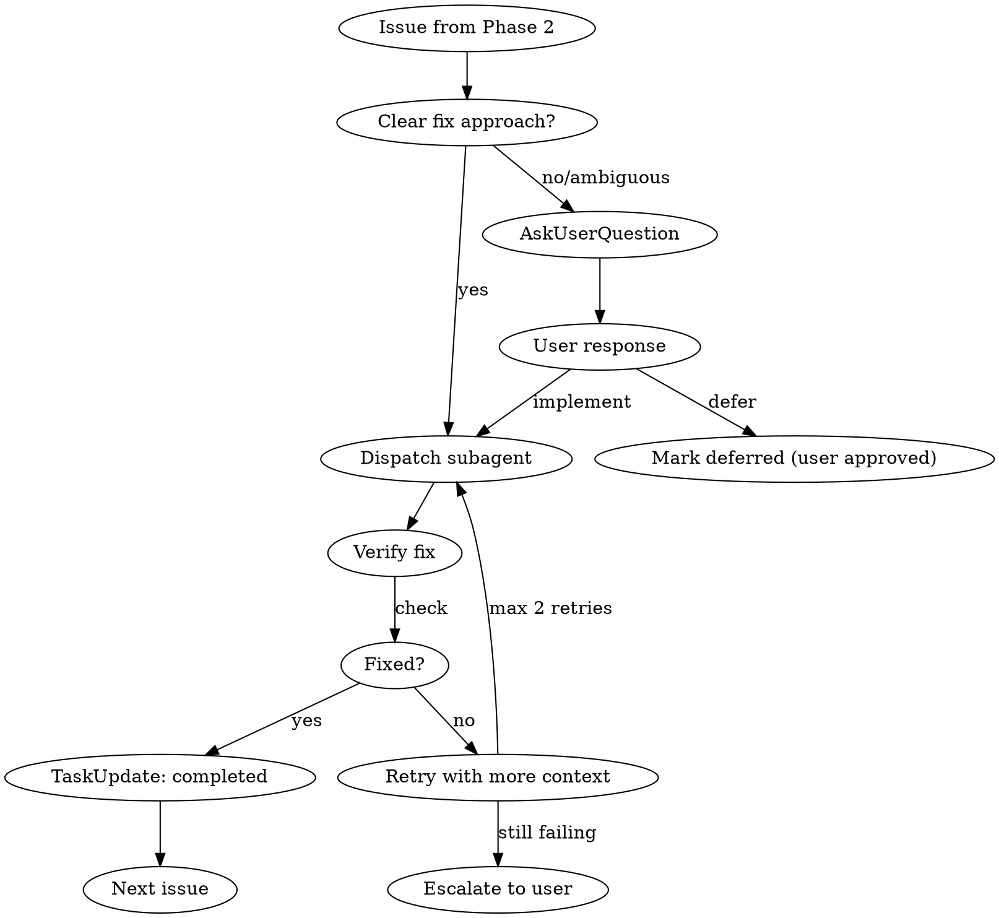
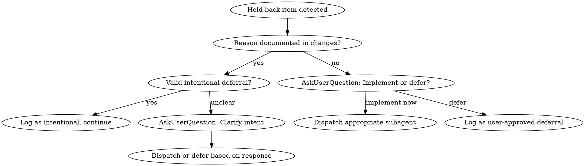

# Plan Validation and Code Review Skill v4.1

This skill performs comprehensive validation of completed implementation work using a parallel subagent architecture for thorough review, **then remediates all issues before committing**.

## Core Principle: Remediation-First

**This skill does NOT just report issues—it FIXES them.**

- Blockers and critical issues → Dispatch subagents to fix
- Ambiguous intent → Ask user for clarification via AskUserQuestion
- Held-back plan items → Implement or explicitly defer with user approval
- All remediations verified → Commit automatically

## Architecture Overview

**Four-Phase Execution:**

```
Phase 1: Pre-Analysis (Parallel)
├── File Analyzer       → file_inventory
├── Lint Runner         → lint_results
├── Test Runner         → test_results
├── Plan Parser         → plan_context
└── Security Scanner    → security_scan_results (NEW in v4.1)

Phase 2: Deep Analysis (Parallel)
├── code-reviewer       → code_review (always)
├── debt-detector       → debt_analysis (always)
├── qa-expert          → coverage_analysis (always)
├── security-auditor   → security_review (ALWAYS - two-tier, v4.1)
├── architect-reviewer → arch_review (conditional)
└── documentation-checker → doc_sync (conditional)

Phase 3: Remediation Execution (Sequential)
├── Create TodoWrite tasks for all issues
├── For BLOCKERS: Dispatch subagent → Verify fix
├── For CRITICAL: Dispatch subagent → Verify fix
├── For held-back items: AskUserQuestion → Implement or defer
├── For ambiguous issues: AskUserQuestion → Resolve
└── Gate: All issues remediated OR user-approved deferral

Phase 4: Synthesis & Commit (Sequential)
├── Collect remediation results
├── Generate final report
├── Update roadmap
├── Archive completed items
└── Commit (unconditional after Phase 3 passes)
```

---

## Phase 1: Pre-Analysis (Run in Parallel)

Launch 4 parallel tasks to gather baseline information before deep analysis.

### Task 1.1: File Analyzer

```
Analyze changed files:
1. Run `git status` to see all modified/added/deleted files
2. Run `git diff --stat` for change statistics
3. Count lines in modified .js files: `wc -l`
4. Check file sizes against thresholds
5. Identify affected systems (battle, economy, auth, etc.)

Output: file_inventory
- files_modified: [list]
- files_added: [list]
- files_deleted: [list]
- lines_added: N
- lines_deleted: N
- file_sizes: { path: lines }
- size_violations: [BLOCKERS/WARNINGS]
- affected_systems: [battle, economy, ...]
```

### Task 1.2: Lint Runner

```
Execute linting:
1. Run `npm run lint`
2. Capture errors vs warnings
3. Categorize by type (import, style, security)
4. Check specifically for @shared violations in API

Output: lint_results
- errors: [list with file:line]
- warnings: [list with file:line]
- shared_violations: [list] (BLOCKER if any)
- passed: boolean
```

### Task 1.3: Test Runner

```
Execute tests:
1. Run `npm run test`
2. Capture pass/fail counts
3. List failing tests with error messages
4. Note skipped tests

Output: test_results
- total: N
- passed: N
- failed: N
- failures: [{ test, file, error }]
- skipped: N
- passed: boolean
```

### Task 1.4: Plan Parser

```
Load and parse plan:
1. Read active plan from /home/wizard/.claude/plans/ (most recent .md)
2. Extract phases and tasks
3. Extract success criteria
4. Extract files to be created/modified
5. Extract implementation order

Output: plan_context
- plan_file: path
- phases: [{ name, tasks, status }]
- success_criteria: [list]
- expected_files: [list]
- implementation_order: [list]
```

### Task 1.5: Security Scanner (NEW in v4.1)

```
Automated vulnerability detection on changed .js files:

1. Collect all changed .js files from file_inventory
2. Run detection patterns using Grep tool:
   - SQL injection patterns (see Security Detection Patterns section)
   - Server validation gap patterns
   - WebSocket security patterns
   - OWASP vulnerability patterns
3. Filter out false positives (comments, test files, safe patterns)
4. Classify findings by severity (BLOCKER/CRITICAL/WARNING)
5. Generate structured output

Output: security_scan_results
- findings: [{ severity, pattern_name, file, line, code_snippet, remediation }]
- blockers_count: N
- criticals_count: N
- warnings_count: N
- passed: boolean (false if any BLOCKER)
```

**Pattern Execution:**

For each pattern in the Security Detection Patterns section:
```bash
# Example grep command for SQL injection detection
grep -rn "pool\.query\s*\(\s*\`" --include="*.js" api/src/
grep -rn "query\s*\(\s*['\"].*\+.*\)" --include="*.js" api/src/
```

**False Positive Filters:**
- Skip lines containing `// SAFE:` or `// eslint-disable`
- Skip files in `__tests__/`, `tests/`, `*.test.js`, `*.spec.js`
- Skip lines that are clearly parameterized (contain `$1`, `$2` with `[` nearby)

### Phase 1 Gate

**STOP if any Phase 1 BLOCKERS:**

| Blocker | Source | Action |
|---------|--------|--------|
| File > 3500 lines | File Analyzer | Report, halt validation |
| `@shared` in API | Lint Runner | Report, halt validation |
| Lint errors (not warnings) | Lint Runner | Report, halt validation |
| SQL injection detected | Security Scanner | Report, halt validation |
| Missing auth on protected route | Security Scanner | Report, halt validation |
| Missing ownership check in query | Security Scanner | Report, halt validation |
| WebSocket handler without auth | Security Scanner | Report, halt validation |
| jwt.decode without verify | Security Scanner | Report, halt validation |
| Trusting client-provided userId | Security Scanner | Report, halt validation |
| Test failures | Test Runner | Report, continue to Phase 2 with warning |
| Security CRITICAL issues | Security Scanner | Report, continue to Phase 2 |

---

## Security Detection Patterns (v4.1)

These patterns are used by Task 1.5 (Security Scanner) and the security-auditor agent for automated vulnerability detection.

### SQL Injection (BLOCKER)

**Pattern 1: Template literal interpolation in queries**
```regex
(pool|query|client)\.query\s*\(\s*`[^`]*\$\{[^}]+\}[^`]*`
```
Example violation: `await pool.query(\`SELECT * FROM users WHERE id = ${userId}\`)`
Remediation: Use parameterized queries with `$1` placeholders and pass values as array

**Pattern 2: String concatenation in queries**
```regex
(pool|query|client)\.query\s*\([^)]*["'][^"']*["']\s*\+
```
Example violation: `await pool.query('SELECT * FROM users WHERE id = ' + userId)`
Remediation: Use parameterized queries with `$1` placeholders

**Pattern 3: Missing parameter array**
```regex
(pool|query|client)\.query\s*\(\s*['"`][^'"`]+\$\d+[^'"`]*['"`]\s*\)(?!\s*,\s*\[)
```
Example violation: `await pool.query('SELECT * FROM users WHERE id = $1')` (no params array)
Remediation: Add parameter array as second argument: `pool.query('...', [value])`

**Pattern 4: Dynamic table/column names**
```regex
(pool|query|client)\.query\s*\([^)]*\$\{[^}]*(Table|Column|Field|table|column|field)[^}]*\}
```
Example violation: `await pool.query(\`SELECT * FROM ${tableName} WHERE id = $1\`, [id])`
Remediation: Use a whitelist of allowed table names, never interpolate directly

### Server Validation Gaps (BLOCKER)

**Pattern 5: Missing numeric validation on IDs/amounts**
```regex
(const|let|var)\s*\{[^}]*(Id|id|amount|quantity|price|gold|level|xp)[^}]*\}\s*=\s*req\.(body|params|query)(?![\s\S]{0,100}(parseInt|Number\(|Number\.isInteger|isNaN))
```
Example violation: `const { characterId } = req.body;` without parseInt validation
Remediation: Always validate numeric inputs: `const characterId = parseInt(req.body.characterId, 10); if (isNaN(characterId)) return res.status(400)...`

**Pattern 6: Trusting client-provided userId (CRITICAL)**
```regex
(const|let|var)\s*\{[^}]*userId[^}]*\}\s*=\s*req\.body
```
Example violation: `const { userId, amount } = req.body;` then using userId for authorization
Remediation: ALWAYS use `req.user.id` from the authenticated JWT, never trust client-provided userId

**Pattern 7: Missing ownership check in character queries (BLOCKER)**
```regex
(SELECT|UPDATE|DELETE)\s+[^;]*FROM\s+characters\s+WHERE\s+id\s*=\s*\$\d(?![\s\S]{0,50}AND\s+(user_id|userId))
```
Example violation: `SELECT * FROM characters WHERE id = $1` (no user_id check)
Remediation: ALWAYS include `AND user_id = $2` in character queries

**Pattern 8: Missing ownership check in inventory/items queries**
```regex
(SELECT|UPDATE|DELETE)\s+[^;]*FROM\s+(character_items|inventory|user_items)\s+WHERE\s+[^;]*(?<!user_id\s*=\s*\$\d)
```
Example violation: Inventory query without verifying ownership
Remediation: Join with characters table or include user_id check

### WebSocket Security (BLOCKER)

**Pattern 9: Handler without auth check**
```regex
(async\s+)?function\s+handle\w+\s*\(\s*ws,\s*[^)]*\)\s*\{(?![\s\S]{0,100}if\s*\(\s*!userId)
```
Example violation: WebSocket message handler that doesn't check `if (!userId) return;`
Remediation: Every handler must verify `const userId = wsUserMap.get(ws); if (!userId) return;`

**Pattern 10: Broadcasting without sanitization**
```regex
broadcast(ToRoom|Message)\s*\([^)]*payload\.(message|content|text)(?![\s\S]{0,30}sanitize)
```
Example violation: `broadcastToRoom(room, { message: payload.message })`
Remediation: Sanitize user content before broadcasting to prevent stored XSS

**Pattern 11: Unvalidated room access**
```regex
(addUserToRoom|rooms\.get|joinRoom)\s*\([^)]+payload\.room
```
Example violation: `addUserToRoom(payload.room, userId)` without validating room access
Remediation: Validate user has permission to join the requested room

**Pattern 12: Missing rate limit in message handler**
```regex
ws\.on\s*\(\s*['"]message['"][\s\S]{0,300}(?!.*checkRateLimit|.*rateLimiter)
```
Example violation: WebSocket message handler without rate limiting
Remediation: Apply rate limiting to prevent message flooding

### OWASP Vulnerability Patterns

**Pattern 13: Broken Authentication - jwt.decode without verify (BLOCKER)**
```regex
jwt\.decode\s*\((?!.*verify)
```
Example violation: `const data = jwt.decode(token)` without verification
Remediation: ALWAYS use `jwt.verify(token, secret)` to validate tokens

**Pattern 14: Broken Authentication - Plaintext password operations (BLOCKER)**
```regex
password[^_]*=\s*(req\.body\.|payload\.)password(?![\s\S]{0,50}(bcrypt|hash|compare))
```
Example violation: Storing or comparing passwords without hashing
Remediation: Use bcrypt.hash() for storage, bcrypt.compare() for verification

**Pattern 15: Sensitive Data Exposure - Logging sensitive data (CRITICAL)**
```regex
(console|logger)\.(log|info|warn|error|debug)\s*\([^)]*\b(password|token|secret|apiKey|refreshToken|accessToken)\b
```
Example violation: `console.log('Auth:', { password, token })`
Remediation: Never log sensitive data; sanitize logs to remove credentials

**Pattern 16: XSS - innerHTML usage (CRITICAL)**
```regex
\.innerHTML\s*=
```
Example violation: `element.innerHTML = userMessage`
Remediation: Use textContent for text, or sanitize HTML with DOMPurify

**Pattern 17: XSS - document.write (CRITICAL)**
```regex
document\.write\s*\(
```
Example violation: `document.write(userInput)`
Remediation: Use DOM manipulation methods instead

**Pattern 18: XSS - eval with user input (BLOCKER)**
```regex
eval\s*\(\s*(req\.|payload\.|data\.|user)
```
Example violation: `eval(payload.code)`
Remediation: Never use eval with user input; use safe alternatives

**Pattern 19: Broken Access Control - Missing role check (CRITICAL)**
```regex
router\.(get|post|put|delete|patch)\s*\(\s*['"]/(admin|mod|moderator)
```
Then check if handler has role verification
Example violation: Admin route without role middleware
Remediation: Add role verification middleware: `requireRole('admin')`

**Pattern 20: Error Stack Exposure (WARNING)**
```regex
res\.(json|send)\s*\([^)]*err\.(stack|message)
```
Example violation: `res.json({ error: err.stack })`
Remediation: Return generic error messages; log full errors server-side only

---

## Phase 2: Deep Analysis (Run in Parallel)

Launch domain-specialized subagents. Always run 3 core agents; conditionally run additional agents based on affected systems.

### Always Invoked

#### 2.1: code-reviewer

```
Task tool with subagent_type: code-reviewer

Prompt:
Review the following changed files with structured checklists:
- [list files from file_inventory]

Context:
- Plan: [plan_context summary]
- Lint status: [lint_results summary]
- Test status: [test_results summary]

REQUIREMENTS:
1. Complete Security Checklist with YES/NO answers
2. Complete Memory Safety Checklist with YES/NO answers
3. Complete Pattern Conformance Checklist
4. Complete domain-specific Edge Case Checklists
5. Classify all findings by severity

Reference: docs/ESTABLISHED_PATTERNS.md
```

#### 2.2: debt-detector

```
Task tool with subagent_type: debt-detector

Prompt:
Analyze the following changed files for technical debt:
- [list files from file_inventory]

Check for:
1. Pattern conformance violations (reference: docs/ESTABLISHED_PATTERNS.md)
2. Coupling violations (services importing other services)
3. Architecture drift (code not in expected locations)
4. YAGNI violations (unnecessary abstractions)
5. Duplicated logic across files

Report: blockers, critical, warnings, info
```

#### 2.3: qa-expert

```
Task tool with subagent_type: qa-expert

Prompt:
Analyze test coverage for the following changes:
- [list files from file_inventory]
- Affected systems: [affected_systems]

REQUIREMENTS (BLOCKING):
1. New API endpoints MUST have integration tests
2. New service functions MUST have unit tests
3. Battle formula changes MUST have balance tests
4. Economy changes MUST have balance tests
5. Bug fixes MUST have regression tests

Complete edge case checklists for affected domains.
Report missing tests as BLOCKERS.
```

### Always Invoked (continued)

#### 2.4: security-auditor (ALWAYS - Two-Tier Scanning, v4.1)

The security-auditor runs on EVERY validation with tiered depth.

**Tier 1: Basic Security Scan (Always)**
```
Task tool with subagent_type: security-auditor

Prompt:
Perform basic security scan on changed files:
- [list files from file_inventory]

AUTOMATED CHECKS:
1. Review security_scan_results from Phase 1 Task 1.5
2. Verify all flagged patterns are true positives (not in comments, test files, etc.)
3. Check for false negatives (patterns that might have been missed)
4. Validate parameterized query usage in all database calls
5. Verify authentication middleware on all protected routes
6. Check for input validation on all user inputs

For each finding:
- Confirm severity classification (BLOCKER/CRITICAL/WARNING)
- Provide specific remediation steps
- Reference codebase patterns from ESTABLISHED_PATTERNS.md

Output format:
- confirmed_blockers: [list]
- confirmed_criticals: [list]
- confirmed_warnings: [list]
- false_positives_dismissed: [list with reason]
- additional_findings: [list of issues not caught by patterns]
```

**Tier 2: Deep Security Audit (Conditional)**
```
Trigger when affected_systems includes: auth, economy, marketplace, inventory, websocket, battle

Task tool with subagent_type: security-auditor

Additional Prompt:
Deep security audit for sensitive systems:
- [list security-relevant files]

MANUAL ANALYSIS:
1. Transaction integrity (race conditions, atomic operations)
2. Game economy exploitation vectors (item duplication, gold manipulation)
3. Battle state manipulation prevention
4. Rate limiting adequacy for sensitive endpoints
5. Error information leakage
6. CSRF protection verification
7. Session management security
8. Input validation completeness
9. WebSocket message authentication chain

Report findings with OWASP classification (A1-A10) and impact assessment.
```

### Conditionally Invoked

#### 2.5: architect-reviewer (if significant structural changes)

```
Trigger when:
- New services created
- New routes created
- Major refactors (>500 lines changed)
- Shared module changes

Task tool with subagent_type: architect-reviewer

Prompt:
Architecture review for:
- [list structural changes]

Evaluate:
- System design consistency
- Scalability implications
- Pattern conformance
- Breaking changes to APIs

Reference: docs/TECHNICAL_ARCHITECTURE.md
```

#### 2.6: documentation-checker (if API/schema/formula changes)

```
Trigger when:
- API routes modified
- Database migrations added
- Battle formulas changed
- Economy logic changed
- New scenes created

Task tool with subagent_type: documentation-checker

Prompt:
Check documentation sync for:
- [list code changes]

Mapping rules:
- New endpoint → API_SPECIFICATION.md
- New migration → TECHNICAL_ARCHITECTURE.md
- Battle change → BATTLE_TURN_SYSTEM.md
- Economy change → ECONOMY_SYSTEM.md
- New scene → GAME_DESIGN.md

Report undocumented changes as CRITICAL.
```

---

## Phase 3: Remediation Execution

**This is the core differentiator of v4.0.** Instead of generating a report with "Next Actions" for the user, this phase actively fixes issues.

### Step 3.1: Create Remediation Task List

After Phase 2 completes, create TodoWrite tasks for all findings:

```javascript
// For each BLOCKER issue
TaskCreate({
  subject: "[BLOCKER] Fix SQL injection in battle.js:45",
  description: "Unparameterized query detected. Replace string interpolation with $1 syntax.",
  activeForm: "Fixing SQL injection vulnerability"
});

// For each CRITICAL issue
TaskCreate({
  subject: "[CRITICAL] Add integration test for /api/coliseum/challenge",
  description: "New endpoint lacks test coverage. Add to coliseum.integration.test.js.",
  activeForm: "Adding integration test for coliseum challenge"
});

// For each held-back plan item
TaskCreate({
  subject: "[HELD-BACK] Phase 3 animations not implemented",
  description: "Plan specified animations but none were implemented. Clarify with user.",
  activeForm: "Clarifying held-back plan item"
});
```

### Step 3.2: Remediation Subagent Dispatch Matrix

Use the appropriate subagent for each issue type:

| Issue Type | Subagent | Context to Provide |
|------------|----------|-------------------|
| Missing tests | `qa-expert` | File paths, endpoint signatures, expected behaviors |
| Security issues | `security-auditor` + `backend-developer` | Vulnerability details, attack vectors, fix patterns |
| Documentation gaps | `documentation-maintainer` | Code changes, expected doc locations, format |
| Code quality issues | `code-reviewer` + `refactoring-specialist` | Files, specific issues, patterns to follow |
| Architecture drift | `architect-reviewer` + `fullstack-developer` | Expected patterns, current violations |
| Lint errors | `code-reviewer` | Error messages, file locations |
| File size violations | `refactoring-specialist` | File path, modularization strategy |
| Held-back features | Ask user → `frontend-developer` / `backend-developer` / `fullstack-developer` | Original requirements, plan context |

### Step 3.2a: Security Issue Remediation Matrix (v4.1)

Security issues require specific subagent combinations for fix and verification:

| Issue Type | Primary Agent | Verifier | Context to Provide |
|------------|---------------|----------|-------------------|
| SQL injection | `backend-developer` | `security-auditor` | Query location, parameterization pattern from ESTABLISHED_PATTERNS |
| Missing auth middleware | `backend-developer` | `security-auditor` | Route file, auth middleware pattern |
| Missing ownership check | `backend-developer` | `postgres-pro` | Query, user_id join pattern |
| Trusting client userId | `backend-developer` | `security-auditor` | Endpoint, req.user.id usage pattern |
| WebSocket auth gap | `websocket-engineer` | `security-auditor` | Handler file, wsUserMap auth pattern |
| WebSocket rate limiting | `websocket-engineer` | `security-auditor` | Message handler, rate limiter integration |
| Input validation gap | `backend-developer` | `qa-expert` | Input type, parseInt/validation requirements |
| XSS prevention | `frontend-developer` | `security-auditor` | DOM manipulation location, sanitization pattern |
| Sensitive data logging | `backend-developer` | `security-auditor` | Log statement, sanitization requirement |
| jwt.decode misuse | `backend-developer` | `security-auditor` | Token handling code, jwt.verify pattern |

**Security Fix Task Template:**
```
Task tool prompt for security fix:

You are fixing a SECURITY BLOCKER that prevents commit.

Vulnerability: [type from detection pattern, e.g., "SQL Injection - Pattern 1"]
OWASP Classification: [A1-A10, e.g., "A1 - Injection"]
File: [file path]
Line: [line number]
Pattern matched: [pattern name from Security Detection Patterns]
Code snippet:
```
[matched code]
```

Impact: [what an attacker could exploit]

Required fix:
- [specific remediation from pattern description]

Reference pattern from ESTABLISHED_PATTERNS.md:
```javascript
[relevant safe code pattern]
```

REQUIREMENTS:
1. Fix the vulnerability completely
2. Ensure fix follows established patterns
3. Add/update tests to verify security (if applicable)
4. Return before/after code comparison

Security-auditor will verify your fix passes the detection pattern.
```

**Security Verification Protocol:**

After fix is applied:
1. Re-run the specific detection pattern grep on the modified file
2. Verify no matches (pattern should not trigger)
3. Verify the fix doesn't break existing tests
4. If fix introduces new patterns, verify they are safe

### Step 3.3: Remediation Flow



### Step 3.4: Clarification Triggers

Use AskUserQuestion when encountering:

| Trigger | Question Format |
|---------|-----------------|
| Ambiguous implementation intent | "The plan mentions [X] but implementation differs. Should I: (a) implement as planned, (b) update plan to match implementation, (c) defer for now?" |
| Held-back items without clear reason | "Phase [N] task [X] was not implemented. Should I: (a) implement it now, (b) defer to next iteration, (c) remove from plan?" |
| Multiple valid remediation approaches | "Found [issue]. I can fix this by: (a) [approach 1], (b) [approach 2]. Which approach?" |
| Breaking changes requiring approval | "Fixing [issue] requires changing [public API/schema/interface]. This may break [X]. Proceed?" |
| Unclear success criteria | "How should I verify [feature] is working correctly? Options: (a) [test approach 1], (b) [test approach 2]" |

### Step 3.5: BLOCKER Remediation

For each BLOCKER, dispatch the appropriate subagent:

```
Task tool prompt template for BLOCKER fixes:

You are fixing a BLOCKER issue that prevents commit.

Issue: [issue description]
File: [file path]
Line: [line number]
Source: [which Phase 2 agent found it]

Context:
- Plan: [relevant plan context]
- Pattern to follow: [reference to ESTABLISHED_PATTERNS.md section]

REQUIREMENTS:
1. Fix the issue completely
2. Verify the fix (run relevant test/lint/check)
3. Return confirmation with before/after

Do NOT just report - IMPLEMENT the fix.
```

### Step 3.6: CRITICAL Remediation

For each CRITICAL issue:

```
Task tool prompt template for CRITICAL fixes:

You are addressing a CRITICAL issue that should be fixed before commit.

Issue: [issue description]
Category: [COVERAGE/DOCUMENTATION/DEBT/SECURITY]
Files affected: [list]

REQUIREMENTS:
1. Implement the fix
2. If adding tests, follow patterns in existing test files
3. If updating docs, follow existing doc format
4. Verify your changes work

Return confirmation of what was fixed.
```

### Step 3.7: Held-Back Item Handling



### Step 3.8: Verification Gate

**DO NOT proceed to Phase 4 until:**

- [ ] All BLOCKER issues are fixed and verified
- [ ] All CRITICAL issues are fixed OR user-approved deferral
- [ ] All held-back items are implemented OR user-approved deferral
- [ ] Lint passes (re-run after fixes)
- [ ] Tests pass (re-run after fixes)

If verification fails after max retries, escalate to user with AskUserQuestion.

---

## Phase 4: Synthesis & Commit

**This phase runs ONLY after Phase 3 completes successfully.** All blockers should be resolved.

### Step 4.1: Collect Final State

Gather remediation results:
- Original Phase 2 findings
- Remediations applied (with before/after)
- Verifications passed
- User-approved deferrals (if any)
- Final lint/test results

### Step 4.2: Classify Remaining Items

After remediation, classify any remaining items:

#### BLOCKER (Cannot Proceed)

- File size > 3500 lines
- `@shared` imports in API code
- SQL injection patterns detected
- Authentication bypass patterns
- Missing auth middleware on protected routes
- Import violations causing runtime errors
- Lint errors (not warnings)
- Critical test failures

#### CRITICAL (Strong Warning, Should Fix)

- No tests for new business logic
- Missing error handling for external calls
- Undocumented public API changes
- Breaking changes to shared modules
- Cyclomatic complexity > 20
- Security issues (non-critical)
- Memory leaks (missing cleanup)

#### WARNING (Flag in Report)

- Documentation out of sync
- Missing JSDoc on exports
- File size 1500-3499 lines without module summary
- Complexity > 15
- Pattern conformance violations
- Edge cases not covered

#### INFO (Note for Reference)

- Minor code style inconsistencies
- Suggestions for improvement
- Optional optimizations

### Step 4.3: Generate Final Report

```markdown
# Plan Validation Report v4.0

## Executive Summary
**Verdict:** COMMITTED (all issues remediated)
**Files Changed:** N (A added, M modified, D deleted)
**Lines Changed:** +X, -Y
**Subagents Run:** N (analysis) + M (remediation)

## Phase 1: Pre-Analysis

### File Inventory
| File | Lines | Status |
|------|-------|--------|
| path/file.js | 450 | OK |
| path/big.js | 2,800 | WARNING |

### Lint Results
- Initial: 2 errors, 3 warnings
- After remediation: 0 errors, 3 warnings

### Test Results
- Initial: 143 passed, 2 failed
- After remediation: 147 passed, 0 failed

## Phase 2: Issues Identified

### BLOCKERS Found
1. **[SECURITY]** `api/src/routes/battle.js:45` - Unparameterized query
2. **[COVERAGE]** Missing test for /api/coliseum/challenge

### CRITICAL Found
1. **[DOCUMENTATION]** New endpoint undocumented

### WARNINGS Found
1. **[DEBT]** Duplicated validation logic (deferred)

## Phase 3: Remediations Applied

### BLOCKER Fixes
| Issue | Subagent | Action | Verified |
|-------|----------|--------|----------|
| SQL injection battle.js:45 | security-auditor + backend-developer | Parameterized query | YES - lint passes |
| Missing test coliseum/challenge | qa-expert | Added integration test | YES - test passes |

### CRITICAL Fixes
| Issue | Subagent | Action | Verified |
|-------|----------|--------|----------|
| Undocumented endpoint | documentation-maintainer | Updated API_SPECIFICATION.md | YES - doc sync check |

### User-Approved Deferrals
| Issue | Reason | Approved |
|-------|--------|----------|
| Duplicated validation logic | Low priority, extract in future refactor | YES - user confirmed |

## Phase 4: Final State

### Checklists Summary (Post-Remediation)
| Check | Status |
|-------|--------|
| All queries parameterized | YES |
| All new endpoints tested | YES |
| Documentation synced | YES |
| Lint passes | YES |
| Tests pass | YES |

### Gap Analysis
- [x] Phase 1: Initial setup - COMPLETE
- [x] Phase 2: Core implementation - COMPLETE
- [~] Phase 3: Polish - PARTIAL (animations deferred with user approval)

## Metrics

| Metric | Before | After |
|--------|--------|-------|
| Blockers | 2 | 0 |
| Critical | 1 | 0 |
| Warnings | 1 | 1 (deferred) |
| Test count | 145 | 149 |
```

### Step 4.4: Unconditional Commit

**After Phase 3 verification gate passes, ALWAYS commit:**

1. All blockers have been remediated and verified
2. All critical issues have been fixed or user-approved deferral
3. Lint passes, tests pass
4. Proceed directly to commit - no user confirmation needed

**Commit includes:**
- Summary of implemented features
- List of remediations applied
- User-approved deferrals noted
- Updated roadmap
- Archived completed items

---

## Commit Message Format

```
feat: [Phase Name] - [Brief Summary]

Implemented:
- [Feature 1]
- [Feature 2]
- [Feature 3]

Remediations applied:
- [BLOCKER] [Issue]: [How fixed]
- [CRITICAL] [Issue]: [How fixed]

User-approved deferrals:
- [Issue]: [Reason for deferral]

Tests added:
- [test file]: [what it tests]

Files changed:
- [file1.js] - [brief description]
- [file2.js] - [brief description]

Validation Report (v4.0):
- Analysis subagents: 5 (code-reviewer, debt-detector, qa-expert, security-auditor, documentation-checker)
- Remediation subagents: 3 (backend-developer, qa-expert, documentation-maintainer)
- Issues found: 2 blockers, 1 critical, 1 warning
- Issues remediated: 2 blockers, 1 critical
- Issues deferred: 1 warning (user-approved)
- Final state: All tests pass, lint clean

Gap analysis:
- Completed: X items
- Deferred (approved): Y items

Next priority:
- [Next task 1]
- [Next task 2]

Co-Authored-By: Claude Opus 4.5 <noreply@anthropic.com>
```

---

## Subagent Reference

| Subagent | Always? | Focus |
|----------|---------|-------|
| `code-reviewer` | Yes | Structured checklists, security, patterns |
| `debt-detector` | Yes | Technical debt, pattern conformance |
| `qa-expert` | Yes | Test coverage, edge cases |
| `security-auditor` | Yes (v4.1) | Two-tier: Basic scan always, deep audit for sensitive systems |
| `architect-reviewer` | Conditional | Structural changes, system design |
| `documentation-checker` | Conditional | Doc sync, API documentation |

---

## Quality Gates Summary

### BLOCKER Thresholds

| Check | Threshold |
|-------|-----------|
| File size | > 3500 lines |
| @shared imports in API | Any |
| Lint errors | Any (warnings OK) |
| SQL injection | Any pattern detected |
| Missing auth middleware | Protected routes |
| Missing endpoint tests | New API endpoints |
| Import violations | Runtime errors |

### Security BLOCKER Thresholds (v4.1)

| Check | Pattern | OWASP |
|-------|---------|-------|
| SQL injection - template literal | `query(\`...\${...\`\)` | A1 - Injection |
| SQL injection - concatenation | `query('...' + var)` | A1 - Injection |
| SQL injection - missing params | `query('...$1...')` no array | A1 - Injection |
| Missing auth middleware | Route without `authenticate` | A2/A5 - Broken Auth/Access |
| jwt.decode without verify | `jwt.decode()` alone | A2 - Broken Authentication |
| Missing ownership check | Character/inventory query without user_id | A5 - Broken Access Control |
| Trusting body userId | `req.body.userId` for authorization | A5 - Broken Access Control |
| WebSocket handler no auth | Handler without userId check | A2 - Broken Authentication |
| eval with user input | `eval(payload.*)` | A1 - Injection |
| Plaintext password ops | Password without bcrypt | A2 - Broken Authentication |

### Security CRITICAL Thresholds (v4.1)

| Check | Pattern | OWASP |
|-------|---------|-------|
| XSS - innerHTML | `.innerHTML =` | A7 - Cross-Site Scripting |
| XSS - document.write | `document.write()` | A7 - Cross-Site Scripting |
| Sensitive data logging | Password/token in console/logger | A3 - Sensitive Data Exposure |
| Missing input length validation | String inputs unvalidated | A1 - Injection |
| Missing numeric validation | ID/amount without parseInt | A1 - Injection |
| Broadcast without sanitization | User content in broadcast | A7 - Cross-Site Scripting |
| Missing WebSocket rate limiting | Message handler no limiter | A2 - Broken Authentication |
| Unvalidated room access | joinRoom without permission check | A5 - Broken Access Control |
| Missing role verification | Admin routes without role check | A5 - Broken Access Control |

### Security WARNING Thresholds (v4.1)

| Check | Pattern | OWASP |
|-------|---------|-------|
| Error stack exposure | `err.stack` in response | A3 - Sensitive Data Exposure |
| Missing CSRF tokens | State-changing POST without CSRF | A5 - Broken Access Control |
| Insecure cookie settings | Missing httpOnly/secure flags | A2 - Broken Authentication |

### CRITICAL Thresholds

| Check | Threshold |
|-------|-----------|
| No tests for business logic | New service functions |
| Missing error handling | External calls |
| Undocumented API changes | Breaking changes |
| Cyclomatic complexity | > 20 |
| Memory leaks | Unreleased resources |

### WARNING Thresholds

| Check | Threshold |
|-------|-----------|
| File size | 1500-3499 lines |
| Missing module summary | Files > 1500 lines |
| Complexity | > 15 |
| Documentation sync | Out of date |
| Edge cases | Not covered |

---

## Important Notes

### Execution Flow
- **Phase 1 first** - blockers here prevent Phase 2
- **Phase 2 agents in parallel** - use Task tool with multiple calls
- **Phase 3 is sequential** - remediate one issue at a time, verify each
- **Phase 4 commits unconditionally** - after Phase 3 gate passes

### Remediation-First Principles
- **FIX issues, don't just report them** - this is the core v4.0 change
- **Use subagents for fixes** - dispatch appropriate agent for each issue type
- **Verify every fix** - re-run lint/test after each remediation
- **Ask when unclear** - use AskUserQuestion for ambiguous situations
- **Track with TodoWrite** - create tasks for each remediation

### Clarification Requirements
- **Ambiguous intent** - ask before implementing
- **Held-back items** - ask user: implement now or defer?
- **Multiple approaches** - ask user which approach to use
- **Breaking changes** - get explicit approval before proceeding

### Post-Remediation
- **Always commit after Phase 3 passes** - no user confirmation needed
- **Keep roadmap fresh** - remove completed items
- **Archive completed work** - update docs/archive/
- **Include remediation summary** - in commit message

### Verification Checks
- **Lint must pass** - after all fixes
- **Tests must pass** - after all fixes
- **Module loading** - verify with `timeout 10 npm run dev:api`
- **@shared imports** - recurring issue, always verify
